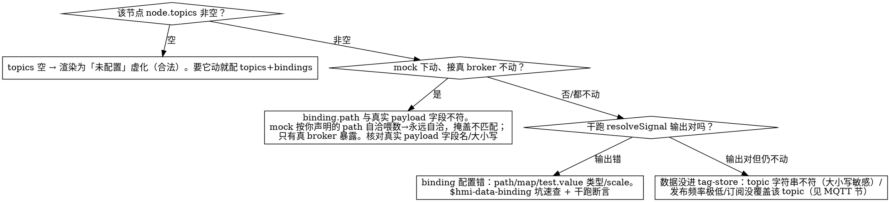

# HMI 运行时排障（渲染出来了但行为不对）

画面起来了但「不对」——图元不动/不变色/`--`/「?」/按钮点了没反应/告警不触发/MQTT 连着却收不到某 topic。本 skill 是**按数据流分层定位**的路径。**先分清你的问题属于哪类**：

- **起不来**（preview/dev server 500、端口冲突、超时）→ 不是这里，去 `$preview-runtime-stability`。
- **起来了但行为错** → 本 skill。

复现/取证手段（截图、点节点、读属性）见 `$hmi-visual-selfcheck`；接线配置规则的真相源是 `$hmi-data-binding`。本 skill 管「怎么按层缩小范围」。

## 数据流（断点就在这条链上的某一环）

```
数据源(真 MQTT / mock 兜底) → tag-store(topic→payload)
  → resolveBinding(topic, path 取原始值) → resolveSignal(map/test/testOff/scale/alarms 翻译)
  → resolveNodeState(values/running/fault/stale/levels/quality) → state-language 装饰 → Canvas 渲染
```
源选路：`!!import.meta.env?.VITE_TIER0_MQTT_HOST` → 真 Tier0 源；否则 **mock 兜底**。

## 按症状定位

| 症状 | 最可能的层 | 查什么 |
|------|-----------|--------|
| 图元**虚化+「?」角标**，从不变 | binding 缺/契约外 | 该节点根本没 `bindings`（未配置虚化是合法态）；或 binding key 不在 `capabilities.ts` 契约内（非阻断告警，但不驱动外观） |
| 图元**实在但不变色/不动**，`--` | stale 或 path 错 | 见下「不动」决策 |
| **整图**全不动 | 源/连接 | 顶栏 `data-status`：disconnected/error→源没连上；connected 但全 stale→见下 |
| 点**动作按钮图元不变** | 命令≠状态（设计如此） | 乐观回显已移除：按钮只发布、不写本地。命令 topic（…/cmd）与状态 topic（…/data）分离时，要等真实反馈回推才变色。mock 下 publish 仅 `console.log`，永不回推→图元本就不会变，**这是预期，不是 bug** |
| 配了 `alarms` **不触发** | path 空 / 非数值 | watch/binding 的 `path` 为空时取整条 payload 对象→数值化得 NaN→阈值永不触发；确认 path 指向具体数值字段 |
| 值显示但**颜色不对**（该红不红） | token / levels | 见「颜色」节 |
| MQTT「已连接」但**某 topic 收不到** | broker 订阅/ACL | 见「MQTT」节 |

## 「图元不动/`--`」决策树（最高频）



**stale 判定**用 `node.topics`（不是 binding.topic）：`topics.length>0 && 无任一字段解析出值 → stale`。所以 binding 改了 topic 却没同步进 `node.topics`，stale 判定会失真。

**干跑 resolveSignal**（不依赖浏览器，最快缩小范围）：
```bash
node --import tsx -e 'import {resolveSignal} from "./src/hmi/data/resolve-signal.ts";
const b={topic:"t",path:"run",test:{op:"eq",value:"1"},testOff:{op:"eq",value:"0"}};
console.log(resolveSignal(b,1), resolveSignal(b,null));'   # 看 value/level/quality
```
或整节点干跑 `resolveNodeState`（src/hmi/scene/scene.ts），喂四态：正常值/越限/异常码/断流(null)。

## 颜色不对

- 该红不红、该黄不黄：先确认 `resolveNodeState` 的 `levels`/`watchLevels`/`fault` 真的算出来了（干跑），再看渲染层。
- **整片颜色透明/不生效**：多半是用了**未注册的 Tailwind token**（如 `bg-success`/`bg-warning` 本库没注册 → class 不产色 → 元素透明）。本库已注册的状态色：`bg-state-running-fg`(绿)、`bg-state-paused-fg`(琥珀)、`bg-destructive`(红)、`text-interlock`(琥珀)。截图难辨时读 `getComputedStyle(el).backgroundColor` 立现。

## MQTT「已连接」却收不到/发不出

排查这几天踩实的点：
- **自发自收假象**：broker 通常**不把同一连接自己发布的消息回推给该连接**。验「能不能发出去」要**另起一条独立连接**订阅目标 topic（跨连接），别指望本连接收到自己发的。
- **通配符 ACL**：某些 broker 限制 `#` / `v1/*` 通配订阅（收不到），但**精确 topic 订阅正常**。收不到先试精确 topic 再判定。
- **WS scheme/port**：`VITE_TIER0_MQTT_HOST` 带 scheme（`wss://host:8084`）时 PORT 变量被忽略；连不上先核 host 串。
- **首帧水合**：低频/静态 topic 靠 `readUnsFn` 首帧拉一次塞进 tag-store；UNS 未配则纯靠 MQTT 推，低频 topic 开局会是 `--` 属正常。
- server fn 静默失败时看**服务端**日志（uns-api 的 catch 已 `console.error`，dev:preview 终端可见），不是浏览器 console。

## 收尾

排障若起了 dev / 加了临时探针脚本 / 改了演示数据，按 `$hmi-visual-selfcheck` 收尾节清理：杀 5173、删 /tmp 探针、改回演示数据。

## 坑速查

| 坑 | 真相 |
|----|------|
| 图元不动就以为绑定错 | 先分层：未配置虚化≠故障；mock 自洽≠真 broker 通 |
| mock 下一切正常就交付 | mock 按你声明的 path 喂数，永远自洽——path 与真实 payload 不符只有真 broker 暴露 |
| 点按钮不变色当 bug 修 | 乐观回显已移除，命令/状态 topic 分离时本就要等真实回推；mock 不回推 |
| 用 preview-runtime-stability 查图元不动 | 那 skill 只管 dev server 起不来，运行时行为问题走错门 |
| 颜色不生效猜半天 | 多半是未注册 token（bg-success 等），读 computed style 比截图快 |
| 本连接收不到自己发的就判发送失败 | broker 不回推自发消息，跨连接验证 |
